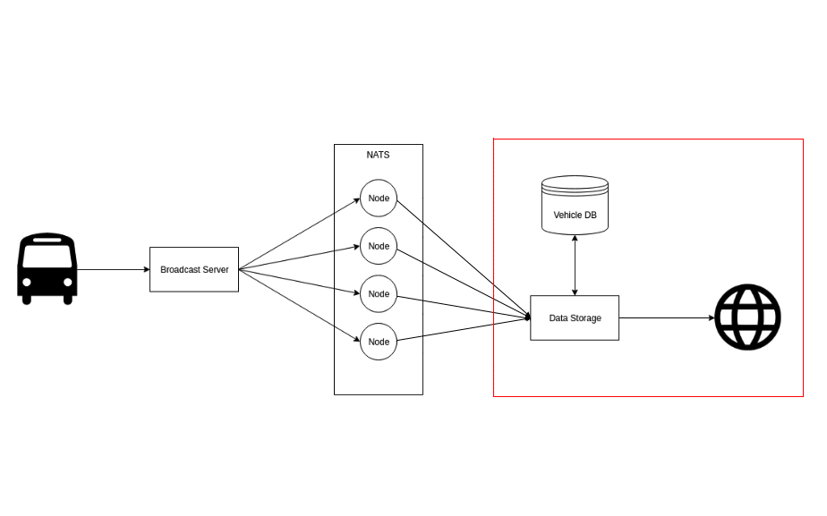

# Microservices Assignment
This is a Microservices project to represent the day to day basis at ViriCiti - Amsterdam.



## Table of contents
- [Intro](#Intro)
- [Technologies used](#Technologies-used)
- [Services](#Services)
- [Pre-requisites](#Pre-requisites)
- [Setup](#Setup)

## Intro
In this project raw data is received from vehicles and stored on database, then it is sent to browser app via websocket and can be acessed via rest-api. 
The services are implemented in node.js and containerized with Docker.

## Technologies used
- NodeJs
- Mongoose
- Express
- WebSockets
- Docker
- Jest

## Services
- #### Stream service
This service keep listening messages broadcast-ed to Nats and save the data in a MongoDB database.

- #### Websocket service
This service watches for changes in the MongoDB database and send the data added to the subscribers.

- #### Rest-api service
This service enables fetch data through a RESTfull API from the MongoDB database by vehicle and data id.

## Pre-requisites
Please note that in order to run the server you must have Docker installed. Check the [Installation Guide](https://docs.docker.com/install) if you haven't got it installed.

## Setup
In order to demonstrate this project please do the following:

#### With Docker containers
1. Clone the repo: ```$ git clone https://github.com/TatyCris/nodejs-assignment.git```
1. Run ```$ docker-compose up``` or in the background ```$ docker-compose up -d``` to build and run all services
1. You can see all containers (stream, web-socker, mongo, nats, rest-api) running ```$ docker ps```
1. To simulate a client receiving the data go to webSocket-api service and run ```$ npm i dotenv``` then ```$ nodemon client-webSocket.js```
1. At the root project directory run ```$ npm run start-broadcast``` to receive the data
1. Watch the data received through the terminal you ran (nodemon client-webSocket.js) as a client at the step 4
1. You can access the API through the endpoints http://localhost:7000/vehicles and http://localhost:7000/:id, where id is the data id

#### Without Docker containers
1. Clone the repo: ```$ git clone https://github.com/TatyCris/nodejs-assignment.git```
1. Run ```$ npm i``` inside each service (rest-api, stream, webSocket-api) in the src folder
1. At the root project directory run ```$ npm run start-nats``` to run Nats on a docker container
1. Inside the stream service create a .env file and set it to:
    ```
    PORT_STREAM=4000
    NATS_URL_STREAM=nats://127.0.0.1:4222
    DATABASE_URL=mongodb://127.0.0.1:27017/vehicles
    ```
1. Inside the stream service run ```$ npm run start-mongodb``` then ```$ npm start```.
You should keep this terminal open and receive a message saying:

    > Mongo is connected
    > stream listen on PORT: 4000
    > NATS is online!

1. Inside the webSocket-api service create a .env file and set it to: 
    ```
    PORT_WEBSOCKET_API=5000
    DATABASE_URL=mongodb://127.0.0.1:27017/vehicles
    ```
1. In other terminal inside the webSocket-api service run ```$ npm start```.
You should keep this terminal open and receive a message saying:

    > Mongo is connected
    > WebSocket listen on PORT: 5000

1. Inside the rest-api service create a .env file and set it to:
    ```
    DATABASE_URL=mongodb://127.0.0.1:27017/vehicles
    PORT_REST_API=7000
    ```
1. In other terminal inside the webSocket-api service run ```$ npm start```.
You should keep this terminal open and receive a message saying:

    > Mongo is connected
    > Api listen on PORT: 7000

1. To simulate a client receiving the data go to webSocket-api service and run ```$ nodemon client-webSocket.js```
1. At the root project directory run ```$ npm run start-broadcast``` to receive the data
1. Watch the data received through the terminal you ran (nodemon client-webSocket.js) as a client at step 10
1. You can access the API through the endpoints http://localhost:7000/vehicles and http://localhost:7000/:id, where id is the data id


